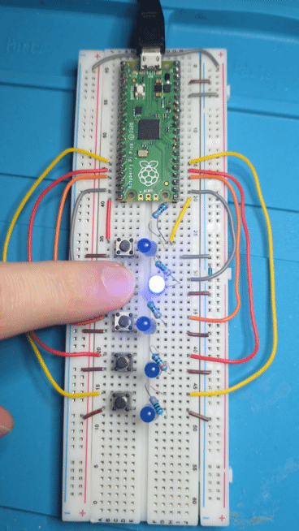

# Iteration 1 — Direct selection (buttons → LEDs)
Iteration 1 is the simplest “lift panel” behavior:
- You have 5 floors (1..5).
- Each floor has a **button** and a corresponding **LED**.
- When you press a floor button, **only that floor LED is ON**.
- The LED stays ON until you press another button.

## What I learned
- Read a button using a GPIO input with `Pin.PULL_DOWN` (stable default `0`, becomes `1` when pressed).
- Drive an LED using a GPIO output (`Pin.OUT`) and switch it with `1` (on) / `0` (off)

## How it works (high level)
- `floors` is a dictionary mapping floor number → `Floor(btn, led)`
- The loop continuously scans all buttons:
  - If a floor button is pressed, that floor becomes the `current_floor` and its LED turns on.
  - All other floor LEDs are turned off.

## Next iteration preview
Iteration 2 keeps the same `Floor` + `floors` setup, but adds:
- `target_floor`
- `moving` state
- a travel animation (`blink()` + step-by-step movement)

## Wiring

## Implementation

