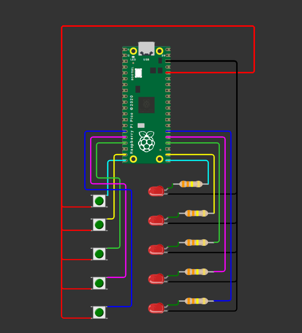

# Iteration 2 — Travel animation (move between floors)
Iteration 2 evolves iteration 1 by simulating the lift *traveling* between floors.

## What I learned
- How to extend the same button+LED base into something more “real” without rewriting everything.
- Basic **state machine thinking**: keep track of `current_floor`, a requested `target_floor`, and whether the lift is `moving`.
- How to create a simple animation by doing a small action repeatedly (blink current floor LED, then step one floor).
- That “travel” is just a loop with timing: do one step, wait a bit (`sleep`), then do the next step.

## What changed vs Iteration 1 (and why)
Iteration 1 directly switches the active LED to the pressed button
Iteration 2 adds a simple “state machine”:
- **`current_floor`**: where the lift is now
- **`target_floor`**: where the lift should go after you press a button
- **`moving`**: whether we’re currently traveling

And it adds one new LED behavior:
- **`Floor.blink()`**: briefly turns a floor LED on/off (used to show movement)

## How the travel works
- When not moving, the code scans buttons and sets `target_floor`.
- While moving, it repeatedly:
  - blinks the LED for the current floor
  - steps `current_floor` by 1 in the correct direction (up/down)
  - stops when `current_floor == target_floor`, then leaves that LED ON

## Next iteration preview
Iteration 3 will keep the same travel logic but add an OLED screen to show:
- current floor
- destination
- direction (up/down)

## Wiring

## Implementation

