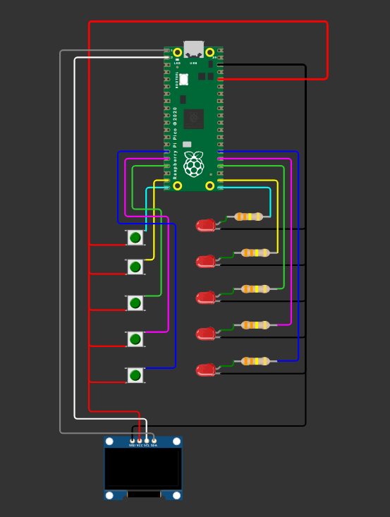

# Iteration 3 — OLED display (lift + screen)

Iteration 3 evolves iteration 2 by adding a small OLED screen so the project feels more like a real lift:
- While traveling, the display shows the **current floor** and a **direction icon** (`^` / `v`).
- When the lift arrives, the display shows a simple **door opening animation**.

## Files
- `Lift_v3.py` — iteration 3 script (iteration 2 logic + OLED UI)
- `ssd1306.py` — SSD1306 OLED driver (copied from the internet, then adjusted)

## What changed vs Iteration 2 (and why)
Iteration 2 already has the “lift state machine” (current floor, target floor, moving) and the LED travel animation.
In iteration 3, I kept that logic and added a new component: an OLED display.

New concepts introduced:
- **I2C bus** setup (using `SoftI2C`)
- **OLED driver** (`SSD1306_I2C`) to draw text and update the screen
- A new machine state for doors: `MachineState.OPPENING` (door opening animation)

## OLED wiring (SSD1306 over I2C)
This OLED uses **I2C** (Inter‑Integrated Circuit), which is a simple 2‑wire communication protocol:
- **SDA**: data line
- **SCL**: clock line

Multiple I2C devices can share the same two wires, and each device has an address

In `Lift_v3.py`, I used:
- `SDA = GP0`
- `SCL = GP1`

Typical connections:
- OLED `VCC` → Pico `3V3(OUT)`
- OLED `GND` → Pico `GND`
- OLED `SDA` → Pico `GP0`
- OLED `SCL` → Pico `GP1`

## How the code works (high level)
`Lift_v3.py` keeps iteration 2’s loop structure:
- When **not moving**, it scans for a pressed button and sets `target_floor`.
- When **moving**, it calls `move_one_floor()` which:
  - blinks the LED for the current floor
  - steps one floor up/down
  - updates `machine_state` (`MOVING_UP` / `MOVING_DOWN`)
- When the lift arrives, it sets `machine_state = OPPENING` and runs a short door animation on the OLED.

## SSD1306 driver: what I copied and what I changed
The file `ssd1306.py` is based on the common MicroPython SSD1306 driver (originally created by Adafruit).

I made a small adjustment to fit my project:
- Changed `SSD1306.text()` to render text using a helper method `SSD1306._text_vertical()`
- The new `_text_vertical()` draws into a temporary framebuffer, then copies pixels into the real framebuffer with a rotation (so the text renders vertically/rotated)

## Wiring

## Implementation
